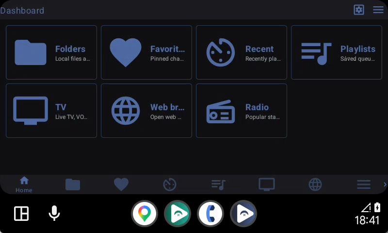
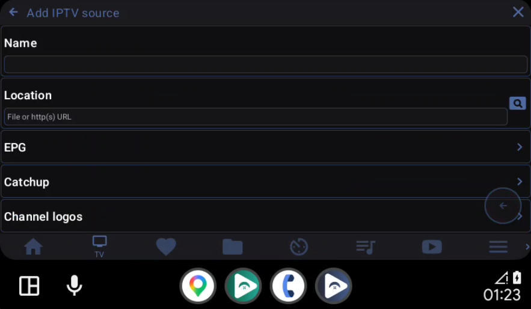
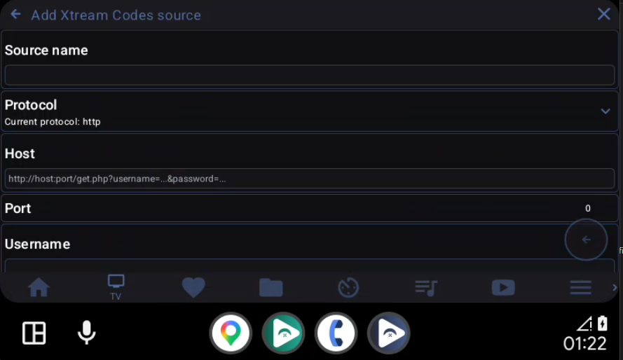
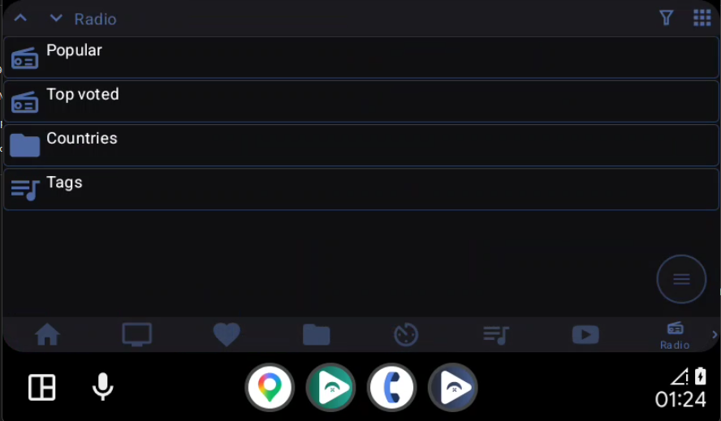

<div align="center">
  

  <h1>FermataX</h1>

  <p>
    A free, open source audio, video, IPTV, radio, and web media player
    customized as a car-friendly media hub for Android Auto.
  </p>

  <p>
    
    
    
    
  </p>
</div>

> [!IMPORTANT]
> FermataX is free and open source. If you paid for this app from an unofficial website or seller, you may have been scammed.

## About

If you love [Fermata](https://github.com/AndreyPavlenko/Fermata), welcome to **FermataX**: a free, open source audio, video, TV player,... with a simple and intuitive interface.

FermataX is a fork of Fermata, customized as a media hub for Android Auto. It brings local media, IPTV/Xtream, Internet Radio, YouTube/Web media, Favorites, Recent, and playlists together in one car-friendly experience.

## Highlights

- **Dashboard-first navigation** for quick access on Android Auto screens.
- **Customizable Dashboard and bottom navigation**: rearrange cards and nav items to match your habits.
- **Xtream Codes support** with Live TV, Movies, and Series.
- **IPTV source support** for M3U playlists, XMLTV EPG, and Catchup.
- **Watch from beginning** and Catchup support for compatible Xtream sources.
- **Internet Radio** with popular stations, top voted stations, countries, and tags.
- **More media services** access inside the same media hub.
- **Favorites, Recent, playlists, and local folders** available from the main screen.
- **Car-friendly UI** designed for fast navigation and repeated daily use.

## Screenshots

| Dashboard | IPTV Sources |
| --- | --- |
|  |  |

| Xtream Codes | Internet Radio |
| --- | --- |
|  |  |

## Disclaimer

FermataX is a media player only. It does not provide, host, sell, or distribute any media content, playlists, TV channels, IPTV services, or Xtream accounts.

Users are responsible for the sources they add.

## Building the project

### Requirements

- Install the latest Android SDK or Android Studio from https://developer.android.com/studio/
- Set `ANDROID_SDK_ROOT` to your Android SDK directory.

```bash
export ANDROID_SDK_ROOT=/path/to/android-sdk
```

On Windows PowerShell:

```powershell
$env:ANDROID_SDK_ROOT="C:\Users\<user>\AppData\Local\Android\Sdk"
```

### Clone

```bash
git clone --recurse-submodules https://github.com/chuoinho/FermataX.git
cd FermataX
```

If you cloned the repository without submodules, run:

```bash
git submodule update --init --recursive
```

### Build AAB

```bash
./gradlew :fermata:bundleAutoRelease
```

Output:

```text
fermata/build/outputs/bundle/autoRelease/
```

### Build Universal APK

```bash
./gradlew :fermata:packageAutoReleaseUniversalApk
```

Output:

```text
fermata/build/outputs/apk_from_bundle/autoRelease/
```

On Windows, use `.\gradlew.bat` instead of `./gradlew`.


## Donate

If you enjoy this app or want to try my app installation service, feel free to buy me a coffee:

<p>
  <a href="https://ko-fi.com/fermatax">
    
  </a>
</p>

## Credits

FermataX is based on [Fermata Media Player](https://github.com/AndreyPavlenko/Fermata) by Andrey Pavlenko.

## License

This project follows the upstream Fermata license. Please respect the original license and attribution requirements.
